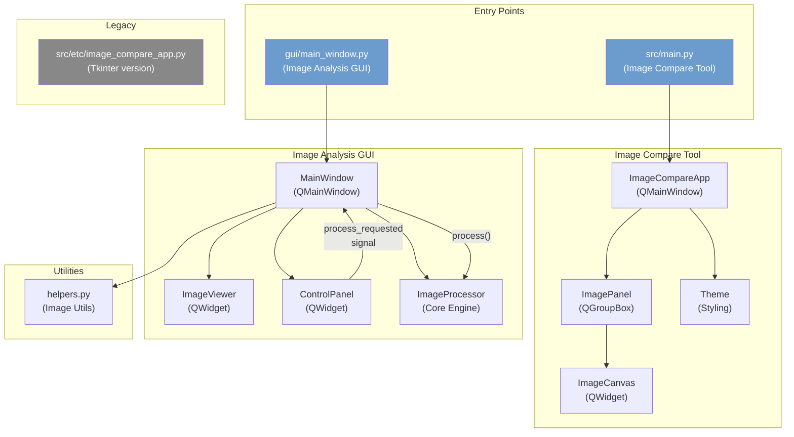
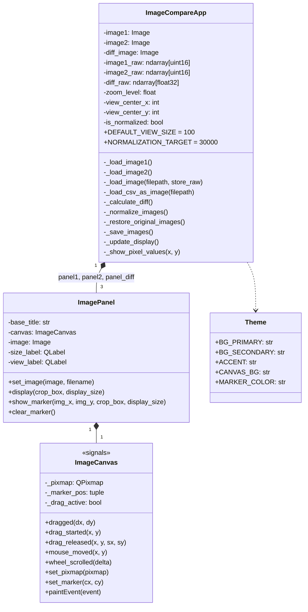
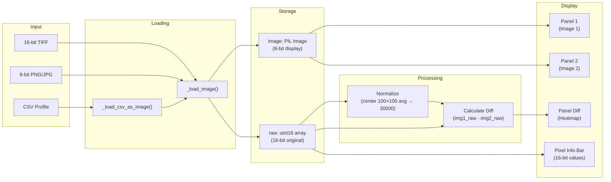
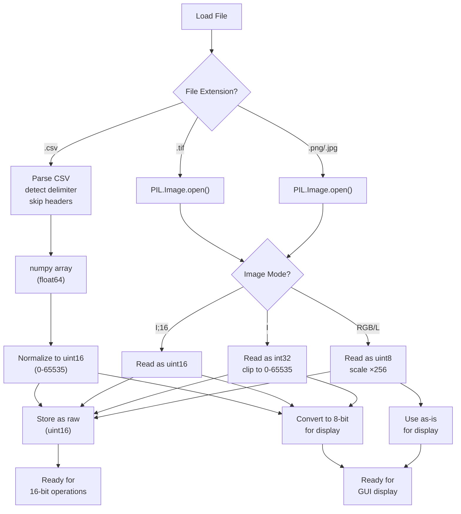
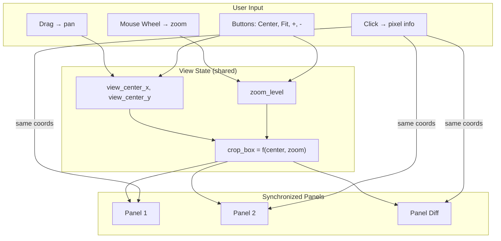
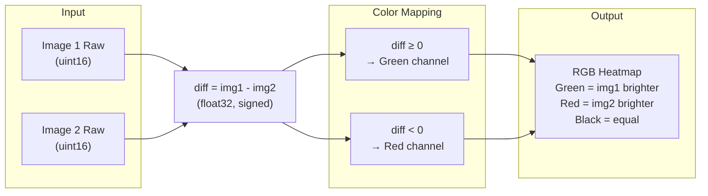
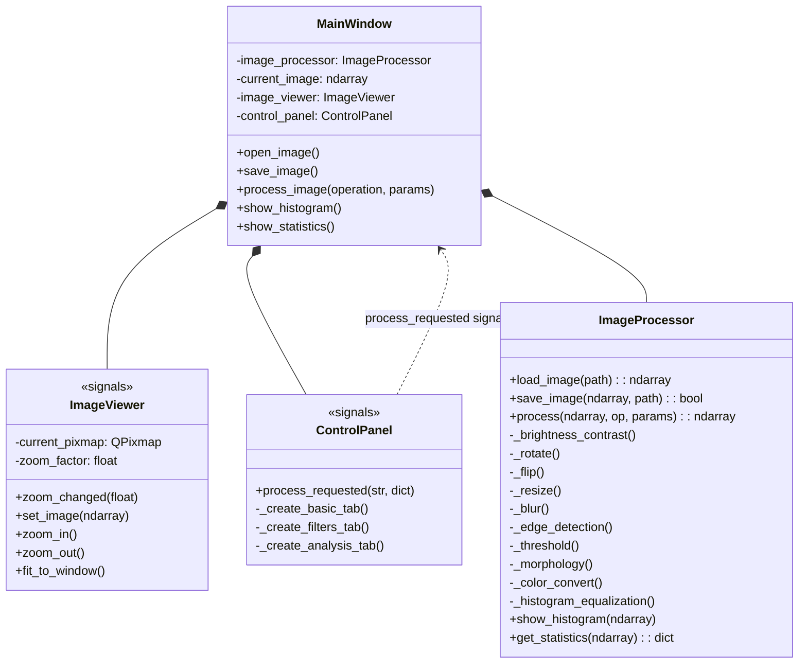
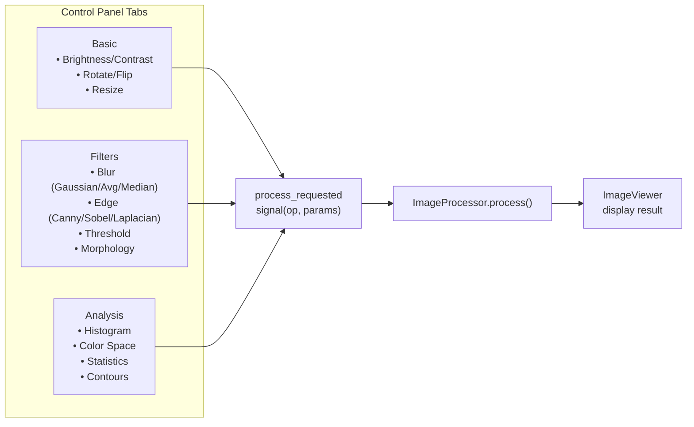
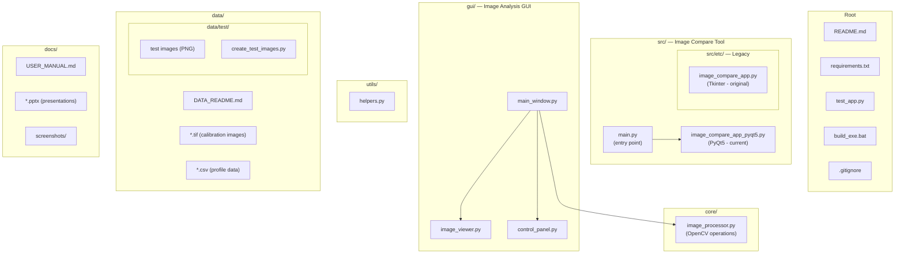

# Architecture Documentation

## Overview

This project contains two GUI applications for image analysis and comparison, built with PyQt5 and Python. Both applications are designed for display hardware calibration workflows, supporting 16-bit TIFF images and CSV profile data.

---

## System Architecture

---

## Application 1: Image Compare Tool

The primary application for comparing two images side-by-side with pixel-level difference visualization. Optimized for 16-bit display calibration images.

### Class Diagram

### Data Flow

### Image Loading Pipeline

### Synchronized View System

### Difference Visualization

---

## Application 2: Image Analysis GUI

A general-purpose image analysis tool with OpenCV-based processing operations.

### Class Diagram

### Processing Pipeline

---

## Project Structure

---

## Technology Stack

| Layer | Technology | Purpose |
|-------|-----------|---------|
| **GUI Framework** | PyQt5 | Window management, widgets, event handling |
| **Image I/O** | Pillow (PIL) | Load/save images (TIFF, PNG, JPG, BMP) |
| **Image Processing** | OpenCV | Filters, edge detection, morphology, color conversion |
| **Numerical** | NumPy | Array operations, 16-bit math, normalization |
| **Visualization** | Matplotlib | Histogram display |
| **Legacy GUI** | Tkinter | Original Compare Tool (preserved in `src/etc/`) |

## Key Design Decisions

1. **Dual raw/display storage**: Images are stored as both 16-bit raw (`uint16` ndarray) and 8-bit display (`PIL.Image`). This preserves precision for pixel-level analysis while enabling GUI rendering.

2. **Synchronized 3-panel view**: All three panels (Image 1, Image 2, Difference) share the same `view_center`, `zoom_level`, and `crop_box`. Any zoom/pan applies to all panels simultaneously.

3. **Green/Red difference heatmap**: Positive differences (img1 > img2) map to green; negative (img1 < img2) map to red. This provides intuitive visual distinction of over/under-exposure.

4. **Center-region normalization**: Normalization targets the center 100×100 pixel region average to a fixed value (30000 in 16-bit scale), making calibration comparisons consistent regardless of absolute brightness.

5. **Fixed 65535 scaling**: 16-bit to 8-bit conversion always divides by 65535 (not by the image's max value), ensuring consistent brightness representation across images with different dynamic ranges.
